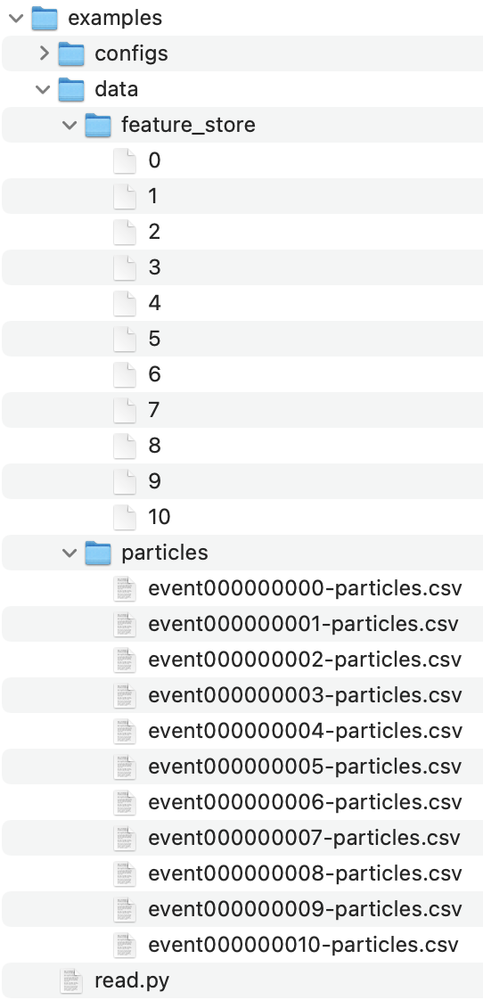

# Exa.TrkX Data IO
Generic data reader for common ML routine.

## Objective
Train multiple model though a pipeline with different input and output data format can be very annoying. For example, when we want to investigate performance of each stage, we need to deal different data format for each stage and this usually requires lots of hard-coding.

This package is aim to simplify this process by providing additional data format definition file. Though this file, data can be read, process, and form suitable dataframe for later use in clean, readable way.

## Features
- Merge data to single object across files from different locations.
- Data processing API for multi-dimensional data.
- Extensible API for custom data format.

### TODO
- Enhance data processing API.
- Support shared data for all events.
- Provide data post-processing API to create missing column automatically.

## Preparation

### Install
Since pip interface is not provided yet, you need to clone this project and install following dependencies:

- Numpy
- Pandas
- PyYAML

The following packages are required for now, but will mark as optional in near feature:

- PyTorch
- PyTorch-Geometric

### Testing
Before you start using this package, it is highly recommended seeing some examples in `examples` folder. To run the example, you need:

- Add project root to your `$PYTHONPATH` or virtual environment package path in order to import package properly. If you are using PyCharm, this should be default behavior. This step will be removed in near feature.
- Get data and place at least 10 event under `examples/data`. In this example, we use `particles/event{evt_id}-particles.csv` and `feature_store/{evt_id}` files. It should be placed as following:

    

- Read through `examples/reader/default.yaml` and `examples/read.py` to see how configuration file works.
- Run `examples/read.py`.

## Customization
### EventFileParser
`EventFileParser` is responsible for loading data from file and extract desired columns from it. To customize file parsing, you can inherit `EventFileParser` and implement following two method:

- `load(self, path: Path) -> Any`:

    Load your data from file and return it here.

- `extract(self, data: Any, tag: str) -> np.array`:
    
    Extract column from data you previously loaded in `load` method here.

Finally, declare your parser in configuration file and you are way to go.

### EventDataProcessor
`EventDataProcessor` is responsible for process data into suitable way to fit into a column of dataframe. For flexibility, the process is breaking into series of procedure and you are free to define your custom step. To customize data processing, you can inherit `EventDataProcessor` and implement following method:

- `process(self, data: np.array, **kwargs) -> np.array`:
    
    Process data and return your result here. No need to constrain yourself to return 1-D array, it is responsibility for user to guarantee the processing pipeline only resulting an 1-D array. 
    
Finally, declare your processor in configuration file and you are way to go.